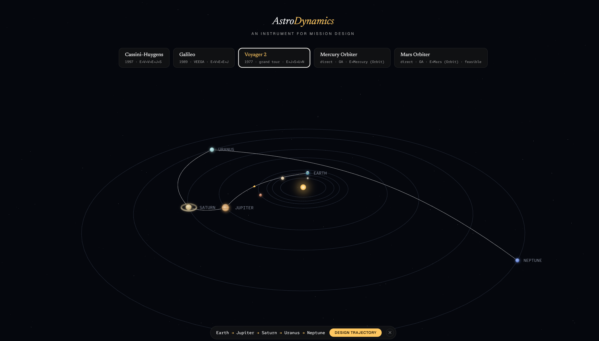
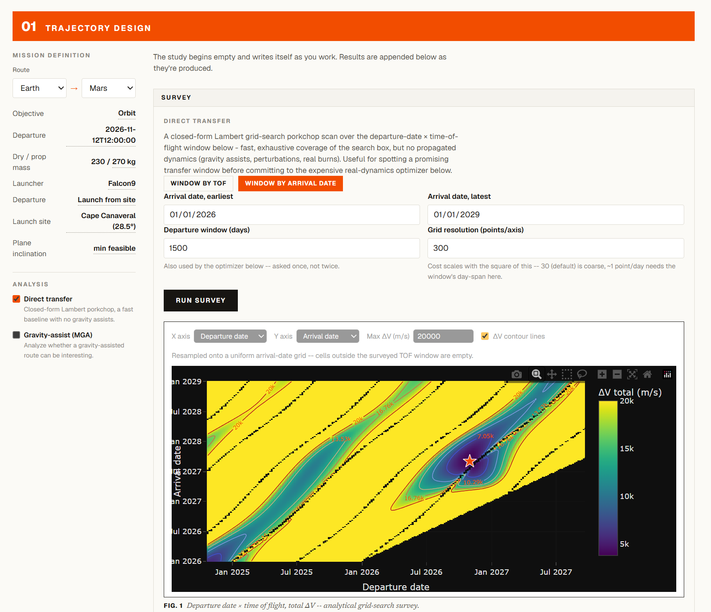
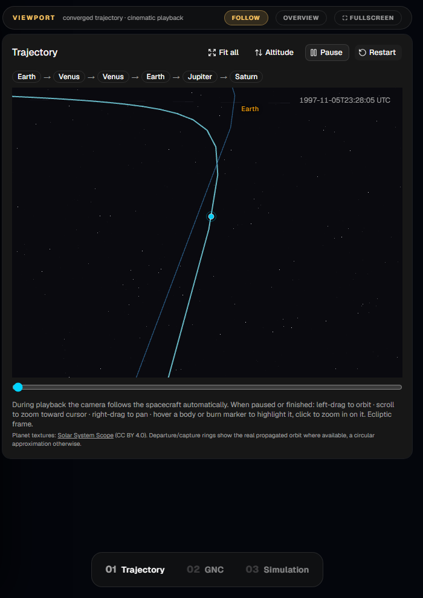
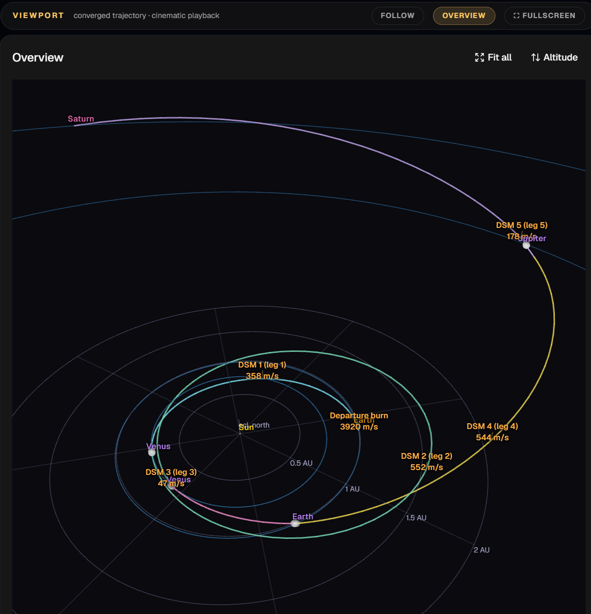
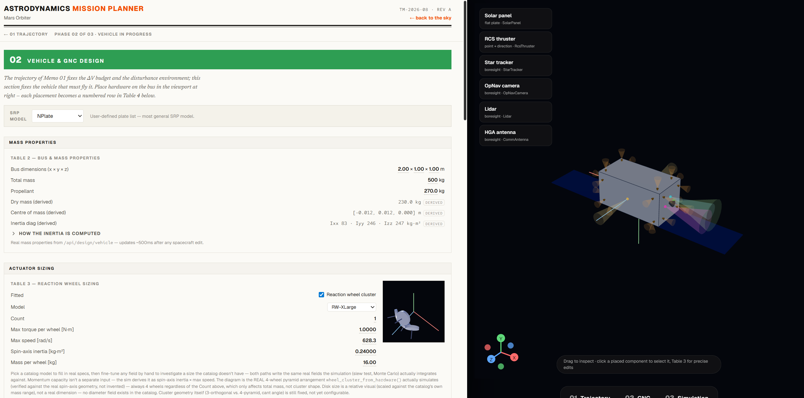
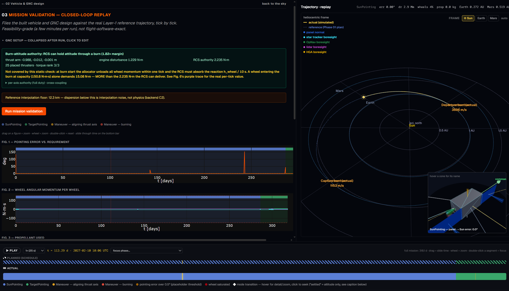

# AstroDynamics Mission Planner — Frontend

Web frontend for designing interplanetary missions end to end: find a trajectory, build the spacecraft that has to fly it, then check the whole thing in a closed-loop GNC simulation. All the physics runs in a Rust backend ([AstroDynamics](https://github.com/tjrotmans/AstroDynamics)); this repo is the React/Three.js interface on top of it.

> Work in progress. The workflow below works end to end, but plenty is still unfinished.



The app opens on an animated solar system. You can click planets to chain a route (Earth → Venus → Venus → Jupiter → Saturn is a valid Cassini-style input), or start from one of the preset tours. A mission then goes through three phases.

## Phase 01 — Trajectory design

The design document writes itself as you work. You define the mission inline, run a Lambert porkchop survey over the departure window, optionally scan gravity-assist routes, and then hand the promising window to the optimizer: GA, PSO, or the multi-gravity-assist (MGA) search with differential evolution, basin hopping and multiple-shooting refinement, all running propagated dynamics on the backend. The result comes back as a complete trajectory: parking orbit, transfer, capture orbit, every burn, a ΔV ledger split between launcher and onboard propellant, and a launch-vehicle feasibility check against real C3 performance curves.



Results play back in a 3D viewport with a chase camera and an event-aware timeline (departure, flybys, deep-space maneuvers, capture):

<p>
  
  
</p>

## Phase 02 — Vehicle & GNC design

A spacecraft builder in the spirit of KSP's assembly building, except every number is real: solar panels, RCS thrusters, star trackers, cameras and antennas snap onto the bus faces, each placement is stored in the backend config, and the mass properties (center of mass, inertia), per-plate SRP forces and per-thruster torque authority update as you build. Slew tests (single runs or Monte Carlo batches) let you check whether the actuators can actually do what the mission needs before committing to a full simulation.



## Phase 03 — Closed-loop mission validation

The mission is re-propagated under 6DOF dynamics — translation, attitude, control and actuation — with the vehicle from Phase 02 flying the burns Phase 01 planned. The replay shows the flown trajectory against the reference, a GNC mode timeline with problem bands (pointing error over budget, wheel saturation), a close-up attitude view, and figures streaming in as the simulation runs.



## Stack

| Layer | Library |
|---|---|
| Framework | React 18 + TypeScript (Vite) |
| 3D | Three.js via @react-three/fiber + drei |
| Charts | Plotly.js |
| UI | shadcn/ui + Tailwind CSS |
| State | Zustand |
| API types | generated from the backend's OpenAPI spec (`npm run gen-types`) |

One rule holds everywhere: no physics in the frontend. Every control maps to a real backend config field, every number on screen was computed by the backend, and a config built here reproduces the same result when run against the Rust backend directly.

## Running

Needs the [AstroDynamics](https://github.com/tjrotmans/AstroDynamics) backend checked out as a sibling directory.

```bash
# Terminal 1 — backend (from AstroDynamics/)
cargo run --bin mission-server --release

# Terminal 2 — frontend
npm install
npm run dev     # http://localhost:5173 (proxies /api → localhost:8000)
```
